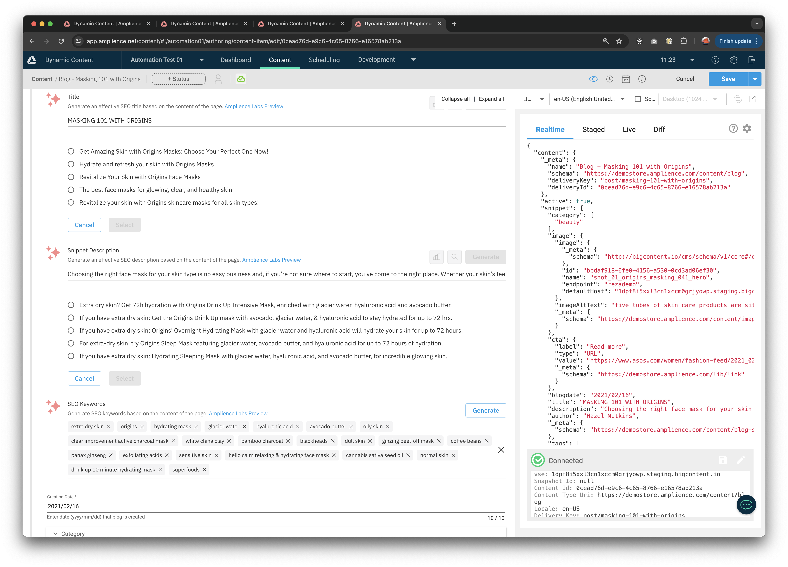
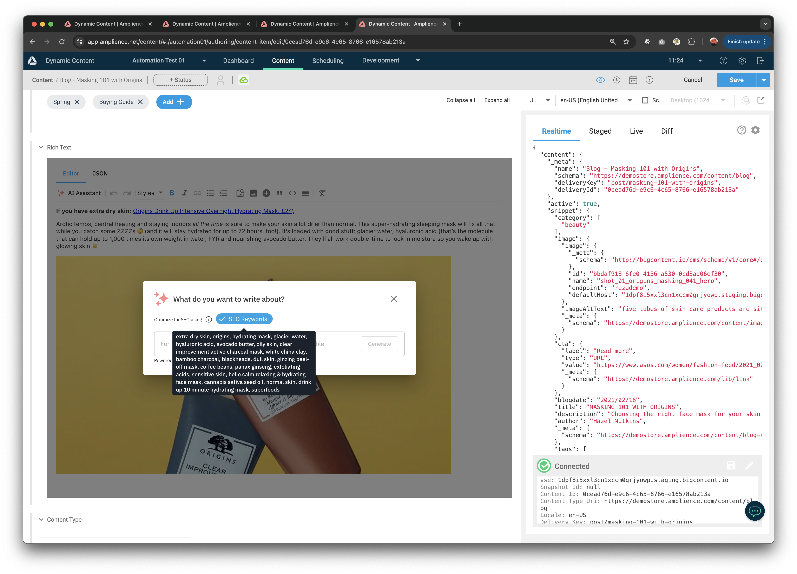
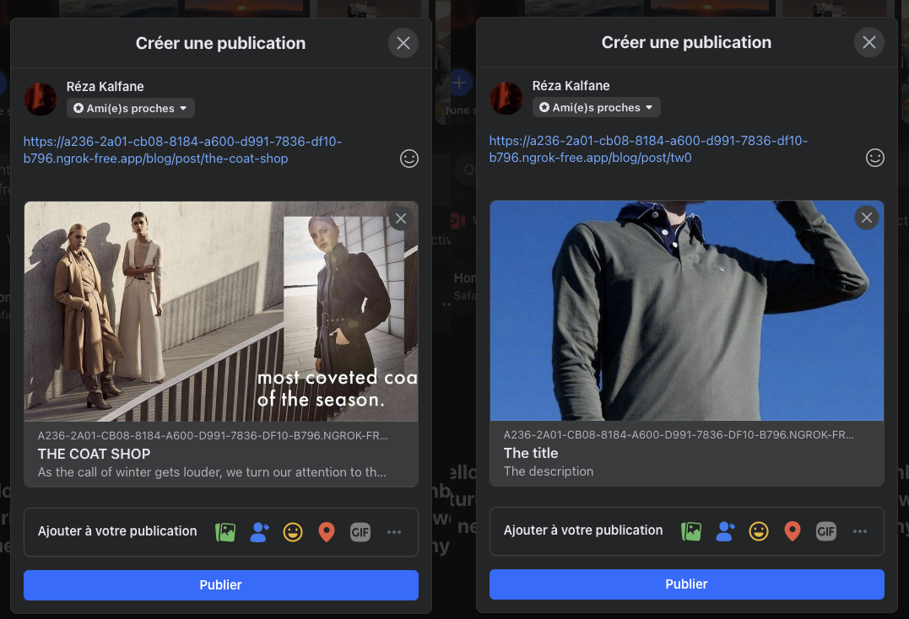

# Blogs

This demostore contains 2 technical methods for listing blog posts in the application. This is intentional to show the differences in capabilities in filtering vs a full search solution.

1. Using the Amplience Filter API
2. Using search powered by Algolia

## Amplience Filter API

Blog posts from Amplience are also configured to be returned from the Filter API. This allows retrieval by:

-   Content Type Schema
-   Active

And also being able to sort the blog posts by the following attributes in ascending and descending order:

-   Date (default sort option and default order is descending )
-   Title
-   Author

### Route

This is located in the following location of your application: `/blog-filter`

### How does this work

This page uses the [Amplience Filter API](https://amplience.com/developers/docs/apis/content-delivery/filter-api/) to return blogs and display as cards.

It takes into account paginated fetching and also adding selected sort options to the filter request.

Code location: `pages/blog-filter`

#### Sample Code

```js
async function getAllBlogs(context:CmsContext, next_cursor = null, order = 'desc', value = 'default', blogs = []) {
    const blogData = [...blogs];

    const filterRequest: GetByFilterRequest = {
        filterBy: [
            {
                path: '/_meta/schema',
                value: 'https://demostore.amplience.com/content/blog',
            },
            {
                path: '/active',
                value: true
            }
        ],
        sortBy: {
            key: 'default',
            order: 'asc'
        },
        page: {
            size: 12
        }
    };

    if(next_cursor && filterRequest.page) filterRequest.page.cursor = next_cursor;
    if(filterRequest.sortBy){
        filterRequest.sortBy.key = value;
        filterRequest.sortBy.order = order as 'asc' | 'desc' | undefined;
    }

    const fetched = await fetchContent([filterRequest], context);
    if (fetched && fetched[0]){
        const res = fetched[0];
        const res2:[] = res.responses
        res2.forEach(function(blog){
            blogData.push(blog)
        })
        if( res.page.nextCursor){
            return await getAllBlogs(context, res.page.nextCursor, order, value, blogData)
        }
    }
    return blogData
}
```

## Search powered by Algolia

When you set up your demostore, you have the option to supply details to automatically index blog posts into Algolia indexes. This shows the power of using a dedicated search platform by giving the user the ability to:

-   Textually search
-   Use facets and filters
-   Retrieve dynamic data from search
-   Log into Algolia directly to setup synonyms, A/B Tests etc
-   Integrate search analytics

### Route

This is located in the following location of your application: `/blog`

### How does this work

This calls the Algolia Search API if configured to return results to the page.

This uses the Algolia React Instant Search component

`"algoliasearch": "^4.23.2",`

And configured the index based on whether the application is in production or staging mode.

Code location: `pages/blog`

#### Sample Code

```js
const searchClient = algoliasearch(algolia.appId, algolia.apiKey);
let hub = cms.hub;
let indexName = stagingApi ? `${hub}.blog-staging` : `${hub}.blog-production`;

function Hit(props: any) {
    return (
        <Box
            style={{
                float: 'left',
                marginRight: 15,
                marginBottom: 15,
                width: '350px',
            }}
        >
            <DynamicBlogListCard data={props.hit} />
        </Box>
    );
}

<InstantSearch indexName={indexName} searchClient={searchClient}>
    <Box
        style={{
            height: '100%',
            marginRight: 20,
            marginTop: 20,
        }}
        sx={{
            float: { sd: 'unset', md: 'left' },
        }}
    >
        <SearchBox style={{ marginBottom: 20 }} />
        <Typography style={{ marginBottom: 10 }} variant="h4">
            Categories
        </Typography>
        <RefinementList
            style={{ marginBottom: 20 }}
            attribute="snippet.category"
            searchable={false}
            searchablePlaceholder="Search categories"
            showMore={false}
        />
        <Typography style={{ marginBottom: 10 }} variant="h4">
            Authors
        </Typography>
        <RefinementList
            style={{ marginBottom: 20 }}
            attribute="snippet.author"
            searchable={false}
            searchablePlaceholder="Search authors"
            showMore={false}
        />
    </Box>
    <Box
        sx={{
            mt: '20px',
            display: 'flex',
            flexWrap: 'wrap',
            w: '100%',
        }}
    >
        <Hits
            style={{
                width: '100%',
            }}
            hitComponent={Hit}
        />
    </Box>
</InstantSearch>
```

## SEO Assistant

Our SEO Assistant extension is using AI to automatically generate title, description, keywords from a text.
It can also automatically generate text content from a list of keywords.





SEO Scoring and Insights allow you to better understand the quality of your content, and displays positive and negative signs about your content.


Demostore is also implementing Meta tags with various tags such as:

-   SEO Title
-   SEO Description
-   SEO Keywords
-   Twitter tags
-   Facebook Open Graph tags


This can for instance help automatically generate the right cards when sharing on Social Media.


